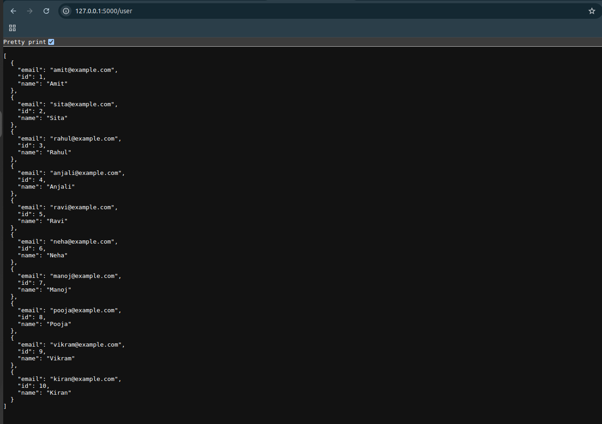

#  Flask User API

A simple Flask REST API that returns static user data in JSON format.

---

##  How to Run This Project

###  Step 1: Clone the Repository

```bash
git clone https://github.com/pdipak007/flask-user-api.git
cd flask-user-api
```

###  Step 2: Create Virtual Environment (Optional but Recommended)

```bash
python3 -m venv venv
source venv/bin/activate  # For Linux/Mac
venv\Scripts\activate     # For Windows
```

###  Step 3: Install Required Packages

```bash
pip install -r requirements.txt
```

###  Step 4: Run the Flask App

```bash
python app.py
```

 You will see:

```
 * Running on http://127.0.0.1:5000/
```

Now the API is live locally.

---

##  API Endpoints

### `GET /user`

Returns a list of 10 sample users in JSON format.

 Sample Response:

```json
[
  {
    "id": 1,
    "name": "Amit",
    "email": "amit@example.com"
  },
  ...
]
```
##  API Output Screenshot



---

##  Project Structure

```
flask-user-api/
│
├── app.py                  # Main Flask application
├── README.md               # Documentation
├── requirements.txt        # Python dependencies
└── output.png              # Screenshot of API output
```
---
